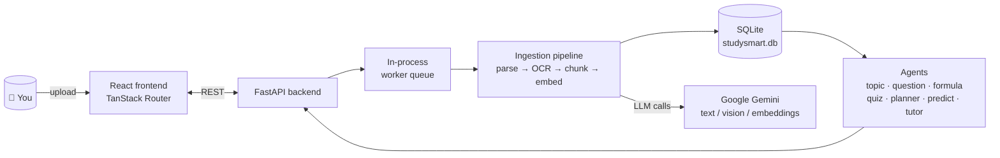

<div align="center">

# 📚 StudySense AI

**A local, single-user AI study platform.**
Upload your notes → get topics, questions, formulas, quizzes, a knowledge graph, exam predictions, and a RAG-powered tutor chat, all running on your own machine.

[](backend/README.md)
[](package.json)
[](backend/app/migrations/001_init.sql)
[](backend/app/services/gemini.py)

</div>

---

## Contents

- [What it does](#what-it-does)
- [How it fits together](#how-it-fits-together)
- [Quick start](#quick-start)
- [Feature tour](#feature-tour)
- [API surface](#api-surface)
- [Environment variables](#environment-variables)
- [Project layout](#project-layout)
- [Testing](#testing)
- [Docs](#docs)
- [Contributing](#contributing)

---

## What it does

StudySense AI turns raw study material (PDF, DOCX, image, or plain text) into a structured, queryable knowledge base:

1. **Ingest** — upload a document; it's parsed, OCR'd if needed, chunked, and embedded.
2. **Understand** — dedicated agents extract topics, likely exam questions, and formulas, and build a knowledge graph linking them.
3. **Study** — chat with a RAG-grounded tutor (every answer cites the source chunk), generate quizzes, get an exam-importance prediction, and follow an auto-built revision planner.

No login, no cloud database, no shipped API key — it's designed to run entirely on your machine. You bring your own Gemini API key.

<details>
<summary><strong>Why "local, single-user"?</strong></summary>

<br>

The backend has no auth layer by design (see <code>src/lib/api.ts</code>). This keeps the project simple for solo use, but it also means **you shouldn't expose it on a public network as-is** — anyone who can reach port 8000 can read/write your documents.

</details>

---

## How it fits together



Everything runs in one process pair — no Redis, no message broker, no external DB.

---

## Quick start

<details open>
<summary><strong>1. Backend (FastAPI)</strong></summary>

```bash
cd backend
python -m venv .venv
source .venv/bin/activate          # Windows: .venv\Scripts\activate
pip install -r requirements.txt
cp .env.example .env               # paste your GEMINI_API_KEY
uvicorn app.main:app --reload --port 8000
```

The server starts even with an empty key — CRUD endpoints work, AI endpoints return a friendly `503` until you add one.

</details>

<details>
<summary><strong>2. Frontend (Bun + Vite + React)</strong></summary>

```bash
bun install
bun run dev
```

Talks to `http://localhost:8000` by default (override with `VITE_API_URL`).

</details>

<details>
<summary><strong>3. Check it's alive</strong></summary>

```bash
curl http://localhost:8000/health
# {"status": "ok", "version": "1.0.0"}
```

</details>

---

## Feature tour

| Route | What it's for |
|---|---|
| `/upload`, `/documents` | Upload and manage source material |
| `/topics` | Ranked topics by extracted importance |
| `/graph` | Interactive knowledge graph of concepts |
| `/quiz` | Auto-generated quizzes from your material |
| `/predict` | Exam-question likelihood prediction |
| `/planner` | Auto-built revision schedule |
| `/chat` | RAG tutor chat, cites source chunks |
| `/revision` | Spaced-revision view |
| `/agents` | See what each backend agent produced |

## API surface

Full reference: [`docs/api.md`](docs/api.md). Highlights:

| Method | Path | Description |
|---|---|---|
| `POST` | `/documents/upload` | Upload a document, kicks off ingestion |
| `GET` | `/documents` | List all documents |
| `GET` | `/graph` | Knowledge graph |
| `POST` | `/chat` | Tutor chat (RAG) |
| `POST` | `/quiz/generate` | Generate a quiz |
| `GET` | `/predict` | Exam prediction |
| `GET` | `/analytics/overview` | Dashboard stats |

## Environment variables

| Variable | Default | Description |
|---|---|---|
| `GEMINI_API_KEY` | — | Required for any AI feature |
| `MAX_WORKERS` | `4` | Background ingestion worker count |
| `LOG_LEVEL` | `INFO` | Logging verbosity |
| `DATA_DIR` | `./data` | Where SQLite DB + uploads live |
| `VITE_API_URL` | `http://localhost:8000` | Frontend → backend URL |

## Project layout

```
backend/app/
├── routers/     # thin HTTP layer, one file per resource
├── services/    # pure logic: chunking, embeddings, Gemini client, retriever
├── agents/      # one file per agent, all inherit BaseAgent
├── workers/     # in-process async job queue
└── migrations/  # numbered SQL files, run on startup

src/
├── routes/      # TanStack Router pages
├── components/  # shared UI + shadcn/radix primitives
├── hooks/       # small reusable hooks
└── lib/         # API client, types, utils
```

## Testing

```bash
cd backend && pytest
```

> Current coverage is limited to `config`, `date_utils`, and `validators` — routers, agents, and services don't have tests yet. Contributions welcome.

## Docs

- [`docs/architecture.md`](docs/architecture.md) — component and data-flow overview
- [`docs/api.md`](docs/api.md) — full endpoint reference
- [`docs/deployment.md`](docs/deployment.md) — local dev + env vars
- [`docs/troubleshooting.md`](docs/troubleshooting.md) — common issues

## Contributing

See [`CONTRIBUTING.md`](CONTRIBUTING.md) and [`CODE_OF_CONDUCT.md`](CODE_OF_CONDUCT.md). Security issues: see [`SECURITY.md`](SECURITY.md).
